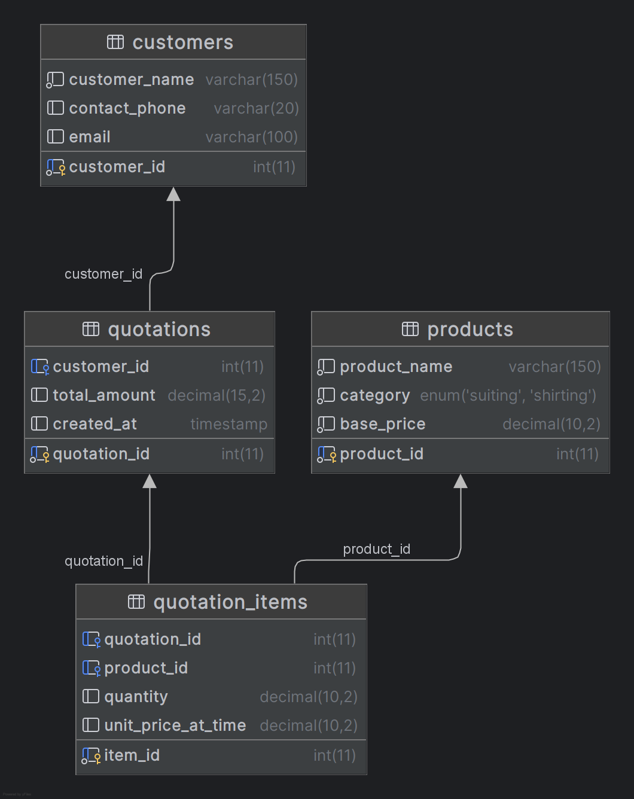

# Textile Quotation System (CSE250-DBMS)

---

## 1. Project Overview

The **Textile Quotation System** is a full-stack B2B web application developed as part of **CSE250 – Database Management Systems** under **KT Impex**, a textile import and export business.

The system automates the process of generating quotations by allowing registered business users to browse textile products, register customers, and raise quotation requests — while giving the admin complete control over pricing, fabric management, and quotation approval workflows.

---

## 2. Features

- **User Authentication** — Signup and login with role-based access (Admin / User)
- **Product Catalogue** — View all textile products with category and base price
- **Customer Registration** — Register new customers via enquiry form with input validation
- **Quotation Generation** — Multi-item quotations with automatic GST (18%) calculation
- **Price Snapshot** — Locks price at time of quote so future price changes do not affect old quotations
- **Quotation Approval Workflow** — Admin can accept or decline quotations with a mandatory decline reason
- **Scoped Quotation History** — Users see only their own quotations; admin sees all
- **Product Management** — Admin can add, edit, and delete products and pricing
- **Input Validation** — Email format, 10-digit phone, positive quantity enforced on backend
- **Secure CORS** — API restricted to local frontend origins only

---

## 3. Technology Stack

| Layer | Technology |
|---|---|
| Database | MariaDB |
| Backend | Node.js + Express.js |
| Frontend | React (Vite) + JSX |
| Styling | CSS (App.css + index.css) |
| Language | SQL, JavaScript (ES Modules) |
| Environment | Linux (WSL) |
| Dev Tool | IntelliJ IDEA |
| Version Control | GitHub |

---

## 4. User Roles

| Role | Access |
|---|---|
| **Admin** | View all quotations, accept/decline with reason, manage products & pricing |
| **User** | Browse products, register customers, create quotations, view own quotation history |

Default admin credentials: `admin` / `ktimpex`

---

## 5. Database Design

The system uses a **MariaDB** relational database (`kt_impex`) with 5 tables — `users`, `customers`, `products`, `quotations`, and `quotation_items`.

```sql
users           → user_id, username, password, email, role, created_at
customers       → customer_id, customer_name, contact_phone, email
products        → product_id, product_name, category, base_price
quotations      → quotation_id, customer_id, user_id, total_amount,
                  status, decline_reason, created_at
quotation_items → item_id, quotation_id, product_id,
                  quantity, unit_price_at_time
```



---

## 6. Project Structure

```
CSE250-TextileQuotation/
├── backend/
│   ├── server.js          ← Express server with all API endpoints + auth + RBAC
│   ├── db.js              ← MariaDB connection pool
│   ├── setup_users.sql    ← Creates users table and alters quotations table
│   ├── .env               ← Environment variables (not committed)
│   └── .env.example       ← Template for environment variables
├── database/
│   ├── schema.sql         ← All CREATE TABLE statements
│   ├── seed.sql           ← Sample product data (6 textile products)
│   └── erd.png            ← Entity Relationship Diagram
├── frontend/
│   ├── src/
│   │   ├── components/
│   │   │   ├── LoginPage.jsx              ← Login + Signup
│   │   │   ├── ProductCatalogue.jsx       ← Products tab
│   │   │   ├── CustomerForm.jsx           ← Register Customer tab
│   │   │   ├── QuotationForm.jsx          ← Create Quotation tab
│   │   │   ├── QuotationHistory.jsx       ← My Quotations / All Requests tab
│   │   │   └── AdminProductManager.jsx    ← Admin: Manage Products tab
│   │   ├── App.jsx            ← Root component with role-based tab navigation
│   │   ├── App.css            ← Main stylesheet
│   │   └── main.jsx           ← React entry point
│   └── index.html         ← HTML shell
├── package.json
└── README.md
```

---

## 7. Frontend Architecture

Built with **React + Vite**. After login, `App.jsx` renders a different set of tabs based on the user's role.

**User tabs:** Products · Register Customer · Create Quotation · My Quotations

**Admin tabs:** Quotation Requests · Manage Products

---

## 8. API Endpoints

| Method | Endpoint | Description |
|---|---|---|
| `POST` | `/api/signup` | Register a new user |
| `POST` | `/api/login` | Login and receive role |
| `GET` | `/api/products` | Fetch all textile products |
| `POST` | `/api/products` | Admin: add a new product |
| `PUT` | `/api/products/:id` | Admin: update product details |
| `DELETE` | `/api/products/:id` | Admin: delete a product |
| `POST` | `/api/enquiry` | Register a new customer (with validation) |
| `POST` | `/api/create-quotation` | Create a new multi-item quotation |
| `GET` | `/api/quotations` | Fetch quotations (scoped by role) |
| `GET` | `/api/quotations/:id` | Fetch single quotation with line items and GST |
| `PATCH` | `/api/quotations/:id/status` | Admin: accept or decline with reason |

### Request / Response Examples

**POST `/api/login`**
```json
// Request
{ "username": "admin", "password": "ktimpex" }

// Response
{ "success": true, "user_id": 1, "username": "admin", "role": "admin" }
```

**POST `/api/create-quotation`**
```json
// Request
{ "customer_id": 1, "user_id": 3, "items": [{ "product_id": 2, "quantity": 50 }] }

// Response
{ "success": true, "quotation_id": 4 }
```

**PATCH `/api/quotations/4/status`**
```json
// Request
{ "status": "declined", "decline_reason": "Requested quantity exceeds current stock." }

// Response
{ "success": true }
```

**GET `/api/quotations/1`**
```json
// Response
{
  "quotation_id": 1,
  "customer_name": "Rajesh Textiles",
  "total_amount": 32500.00,
  "gst_18": 5850.00,
  "grand_total": 38350.00,
  "status": "accepted",
  "items": [{ "product_name": "Premium Cotton Suiting", "quantity": 50, "line_total": 32500.00 }]
}
```

---

## 9. Installation & Setup

```bash
git clone https://github.com/Rewant1908/CSE250-TextileQuotation.git
cd CSE250-TextileQuotation
```

**Database setup (run once in MariaDB):**
```sql
CREATE DATABASE kt_impex;
USE kt_impex;
SOURCE database/schema.sql;
SOURCE database/seed.sql;
SOURCE backend/setup_users.sql;
```

**Terminal 1 — Backend:**
```bash
cd backend && node server.js
```

**Terminal 2 — Frontend:**
```bash
cd frontend && npm install && npm run dev
```

Open `http://localhost:5173` in your browser.

---

## 10. Security Features

- **Role-Based Access Control** — Admin and user dashboards are completely separated
- **Scoped queries** — Users can only fetch their own quotations via `user_id` filter
- **CORS restricted** — Only local frontend origins are allowed
- **Input validation** — Email format, 10-digit phone number, name length enforced
- **Item sanitization** — Product IDs must be positive integers, quantity must be > 0
- **Parameterized queries** — All SQL uses `?` placeholders to prevent SQL injection
- **Transaction rollback** — Failed quotation creation rolls back all DB changes

---

## 11. Course Information

- **Course**: CSE250 – Database Management Systems
- **Project**: Textile Quotation System
- **Business**: KT Impex (Textile Import & Export)
- **Database**: kt_impex

---

## 12. Team Members

- Rewant Agrawal
- Vijay Kumar
- Kishna Rana
